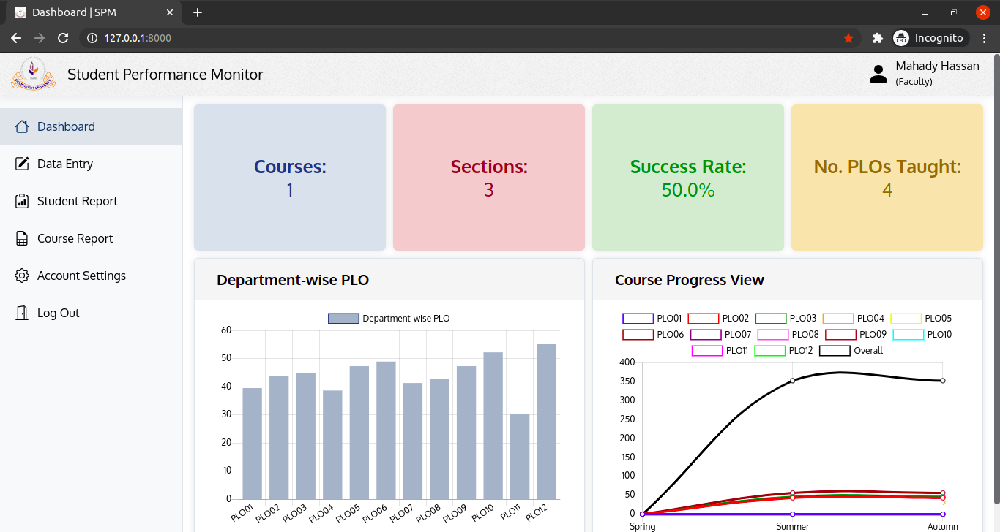

# Student Performance Monitor
A web-based application written in Python (Django) to monitor the performances of university students, particularly engineering students from Independent University, Bangladesh. It uses Program Learning Outcomes (PLOs) as provided by IEB to evaluate the students.

## Run SPM Server
1. Clone the repository using `git clone https://github.com/armunalam/spm.git`
2. Open the terminal (or command prompt), and `cd` into the cloned 'spm' directory.
3. Run the command: `python manage.py runserver` or `python3 manage.py runserver`
4. Open a browser and go to the url: http://127.0.0.1:8000/

## Dependencies
1. Python 3
2. Django
3. NumPy
4. pandas (not required to run the server: it was used only to import dummy data from csv files)

## Login Credentials
A few dummy users have already been created in the database. Information of 3 such users from 3 different user categories are shown below.
* Student:
    - Username: 1810281
    - Password: 34512312Aa
* Faculty:
    - Username: 1234
    - Password: 34512312Aa
* Higher Management:
    - Username: mayabee
    - Password: 34512312Aa

## Contributers
* Armun Alam
* Tanzila Tahsin Mayabee
* Talha Hassan
* Sadia Khan
* Jannat Khair Chowdhury
* Samsul Amin